# Introduction to Terraform

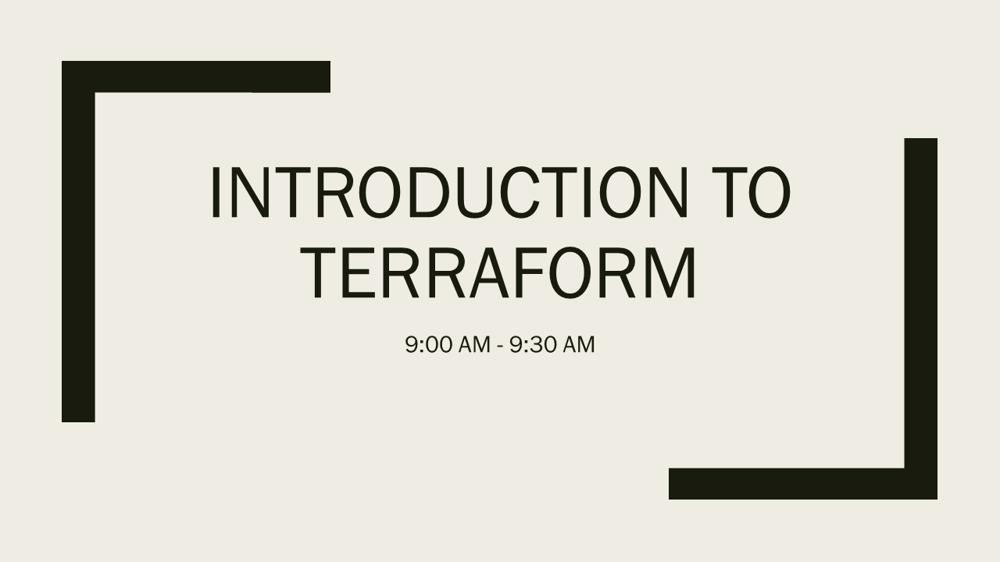
<figcaption align = "center"><b>Slide 1</b></figcaption>

<figcaption align = "center"><b>Slide 2</b></figcaption>

<figcaption align = "center"><b>Slide 3</b></figcaption>

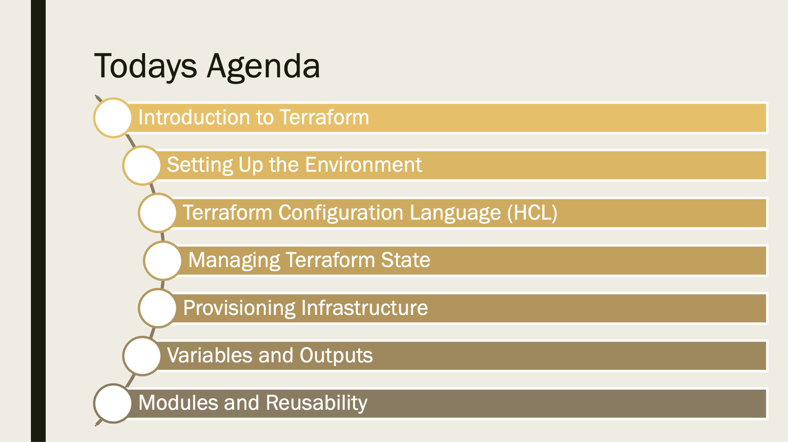
<figcaption align = "center"><b>Slide 4</b></figcaption>

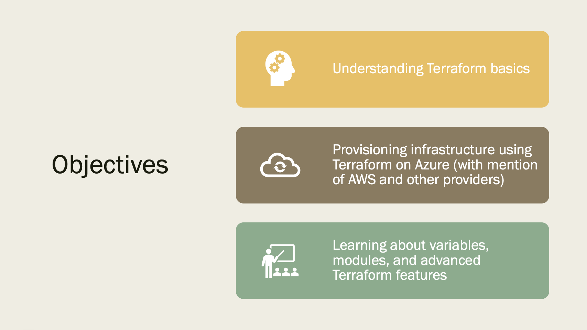
<figcaption align = "center"><b>Slide 5</b></figcaption>

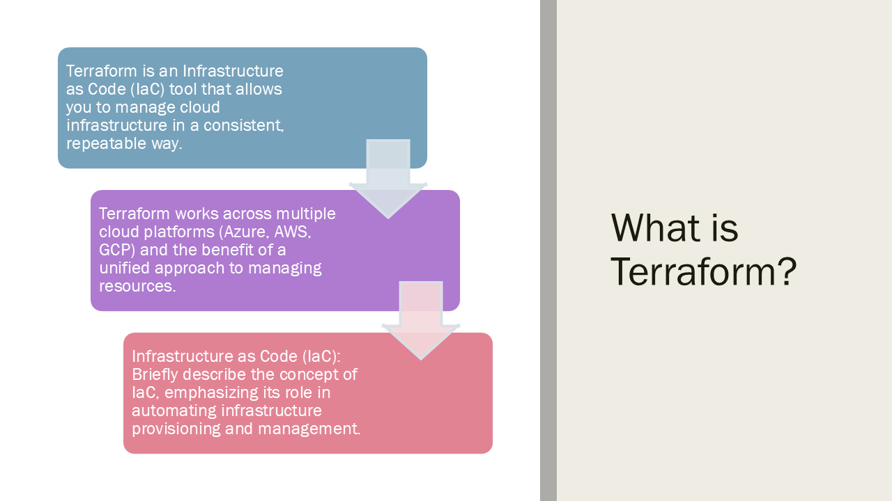
<figcaption align = "center"><b>Slide 6</b></figcaption>

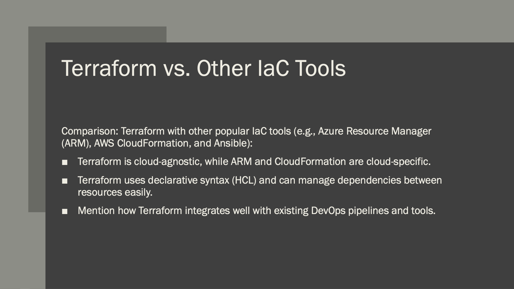
<figcaption align = "center"><b>Slide 7</b></figcaption>

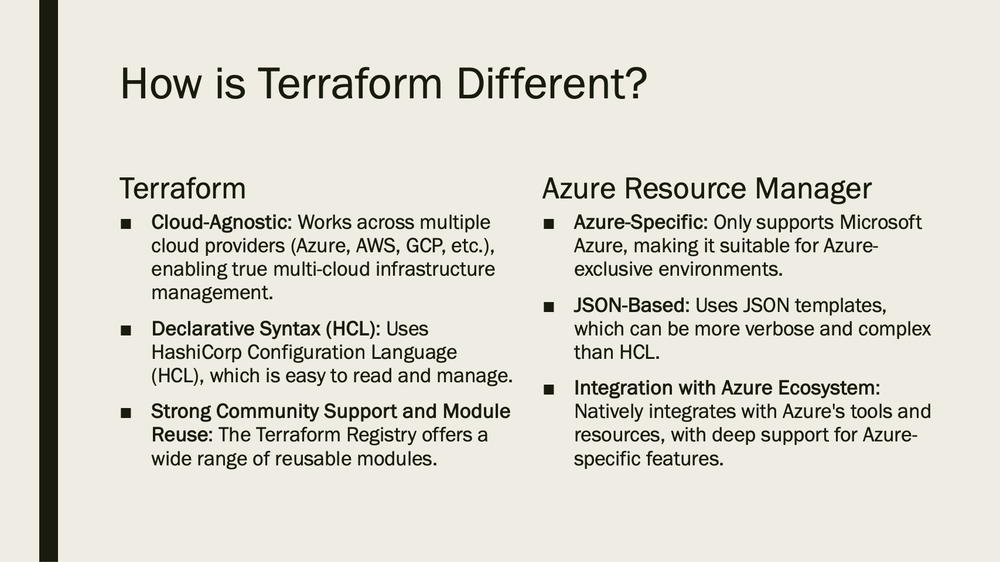
<figcaption align = "center"><b>Slide 8</b></figcaption>

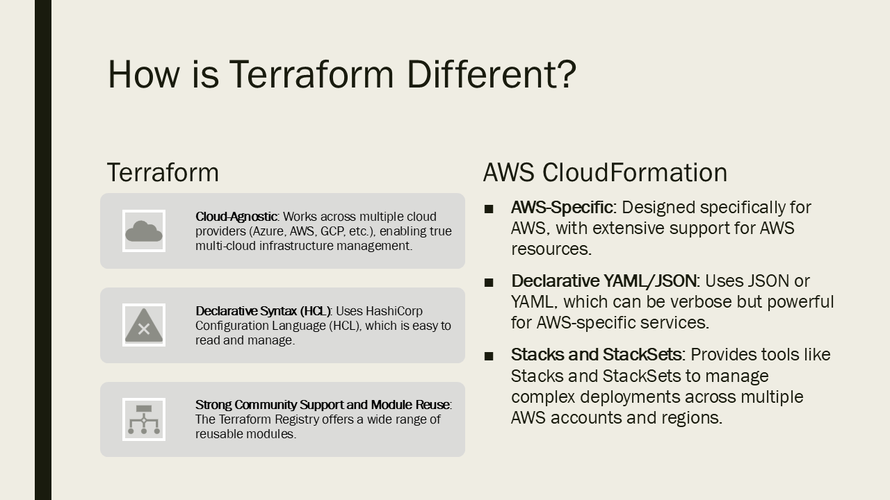
<figcaption align = "center"><b>Slide 9</b></figcaption>

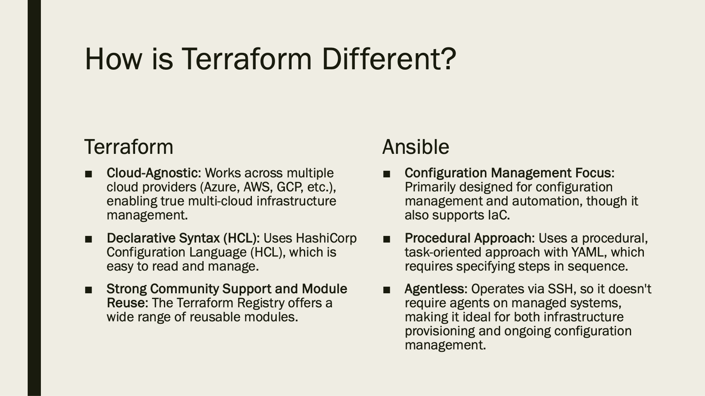
<figcaption align = "center"><b>Slide 10</b></figcaption>

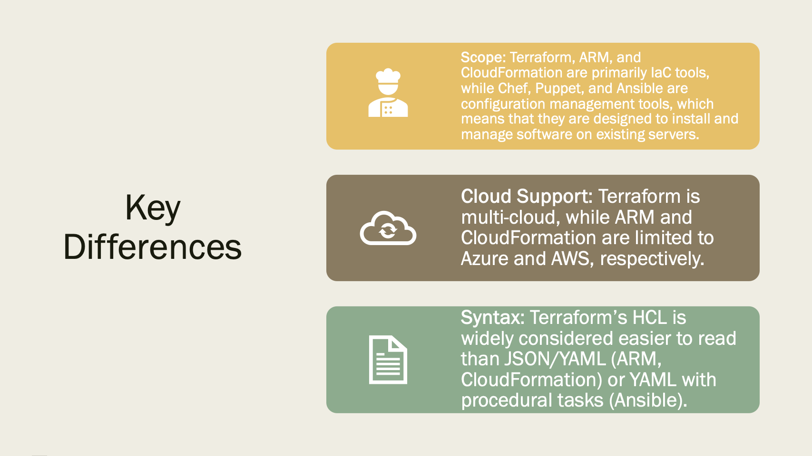
<figcaption align = "center"><b>Slide 11</b></figcaption>

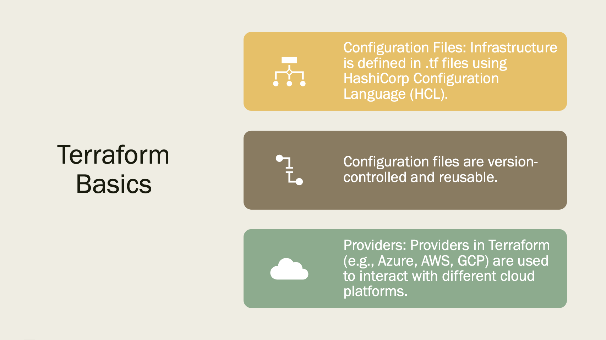
<figcaption align = "center"><b>Slide 12</b></figcaption>

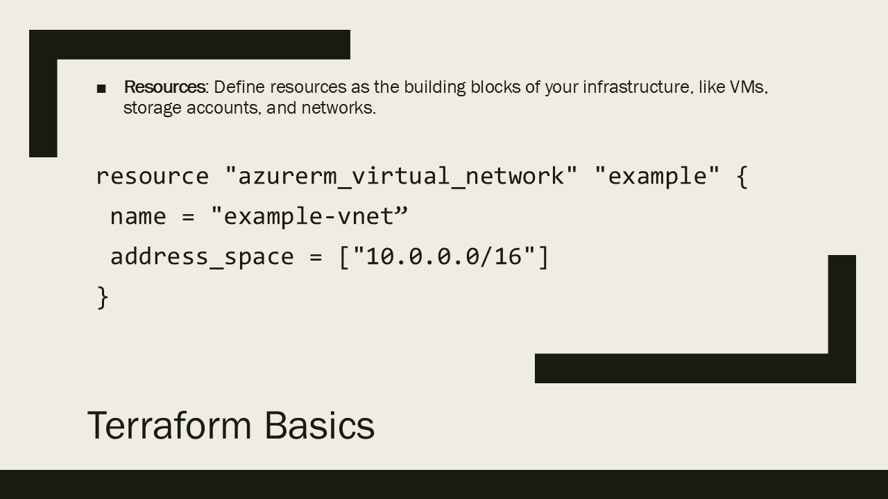
<figcaption align = "center"><b>Slide 13</b></figcaption>

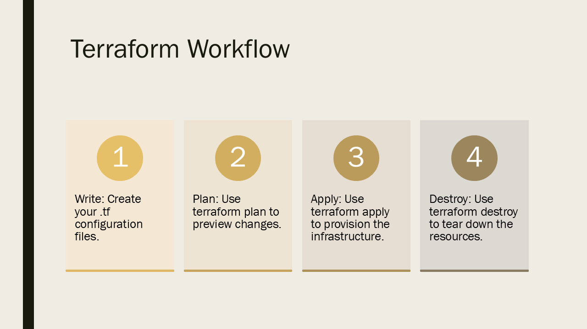
<figcaption align = "center"><b>Slide 14</b></figcaption>

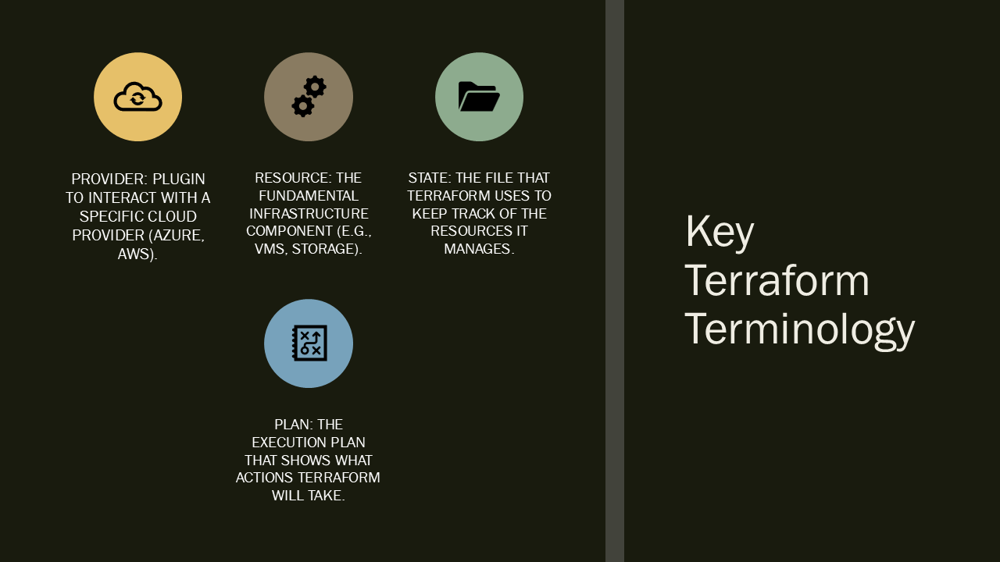
<figcaption align = "center"><b>Slide 15</b></figcaption>
