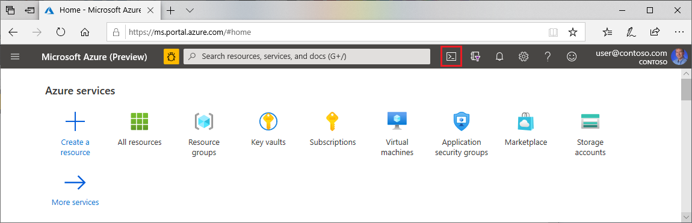
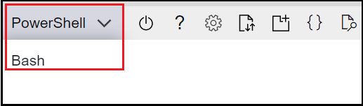

# Configure Terraform in Azure Cloud Shell with Azure PowerShell

## Configure your environment
   * Azure subscription: If you don't have an Azure subscription, create a [free account](https://azure.microsoft.com/free/) before you begin.

## Open Cloud Shell
   
1. If you already have a Cloud Shell session open, you can skip to the next section.

2. Browse to the Azure portal

3. If necessary, log in to your Azure subscription and change the Azure directory.

4. Open Cloud Shell.



5. If you haven't previously used Cloud Shell, configure the environment and storage settings.

6. Select the command-line environment.



## Get Version of Terraform
   Cloud Shell automatically updates to the latest version of Terraform. However, the updates come within a couple of weeks of release.

1. Determine the version of Terraform being used in Cloud Shell.

```Bash
terraform version
```

## Verify the default Azure subscription
   When you log in to the Azure portal with a Microsoft account, the default Azure subscription for that account is used.

Terraform automatically authenticates using information from the default Azure subscription.

Run az account show to verify the current Microsoft account and Azure subscription.

```Bash
az account show
```

Any changes you make via Terraform are on the displayed Azure subscription.